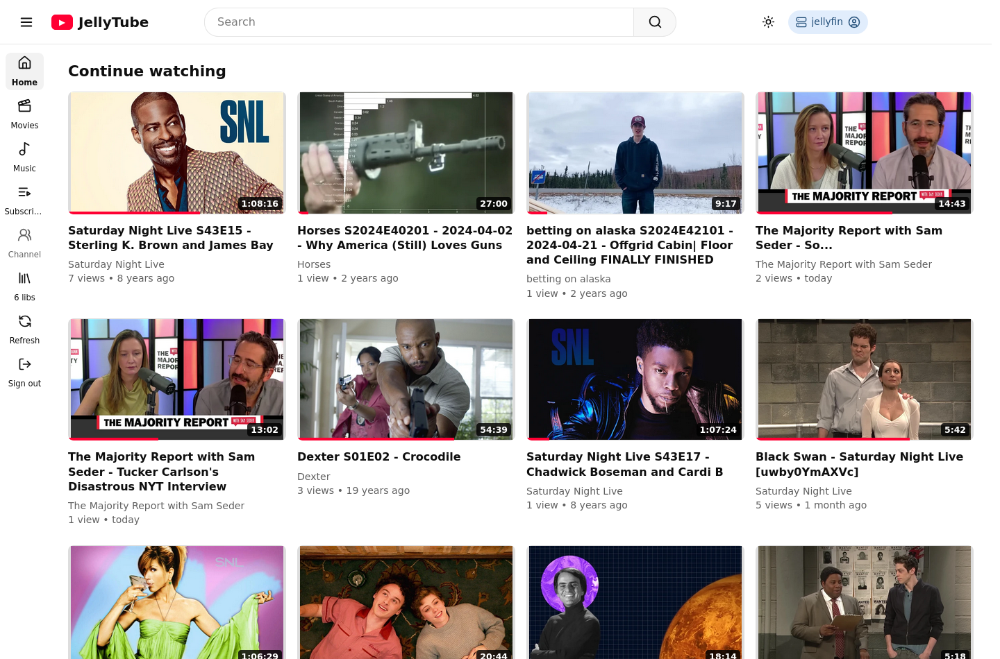
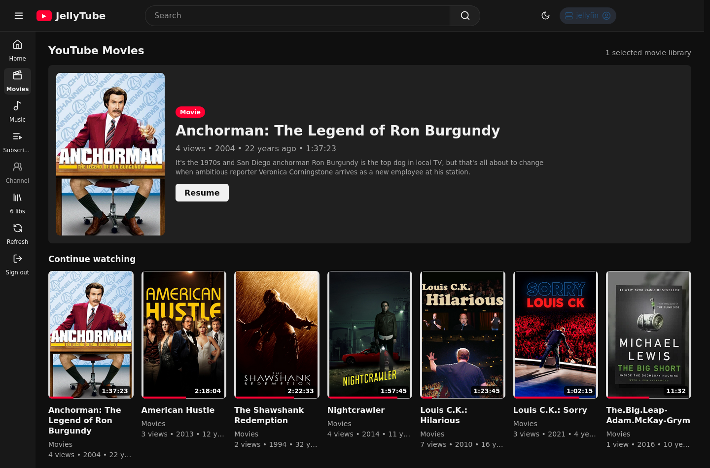
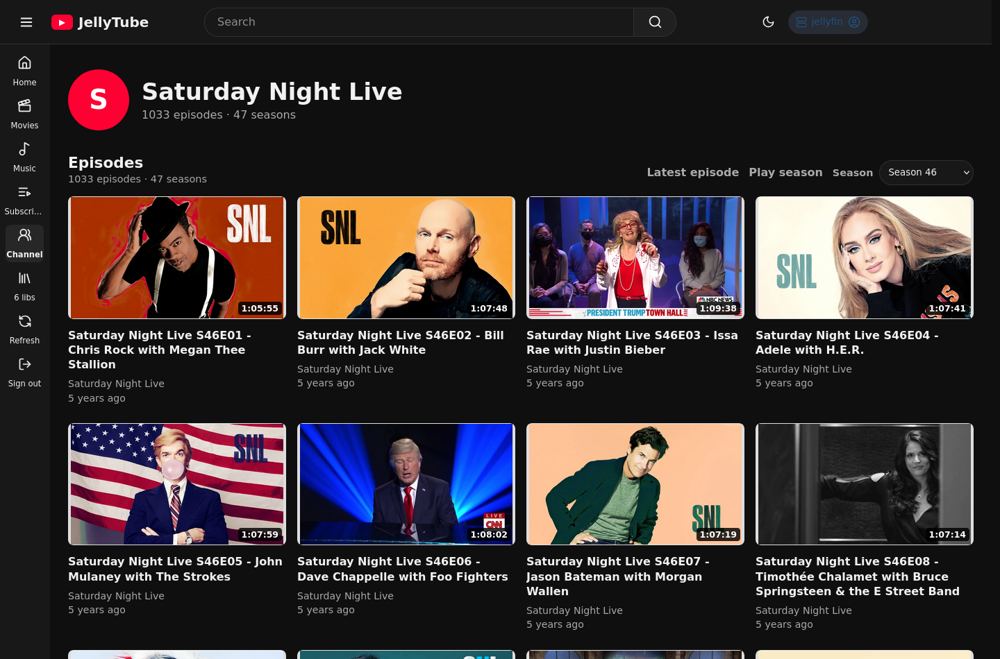
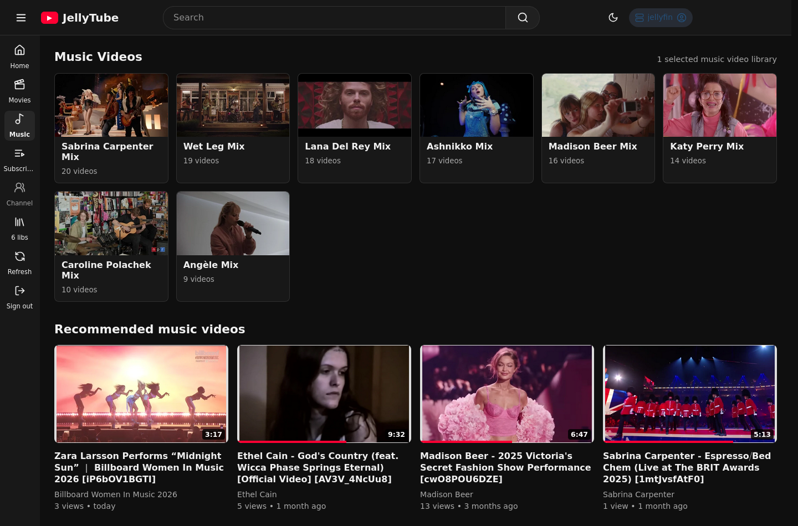
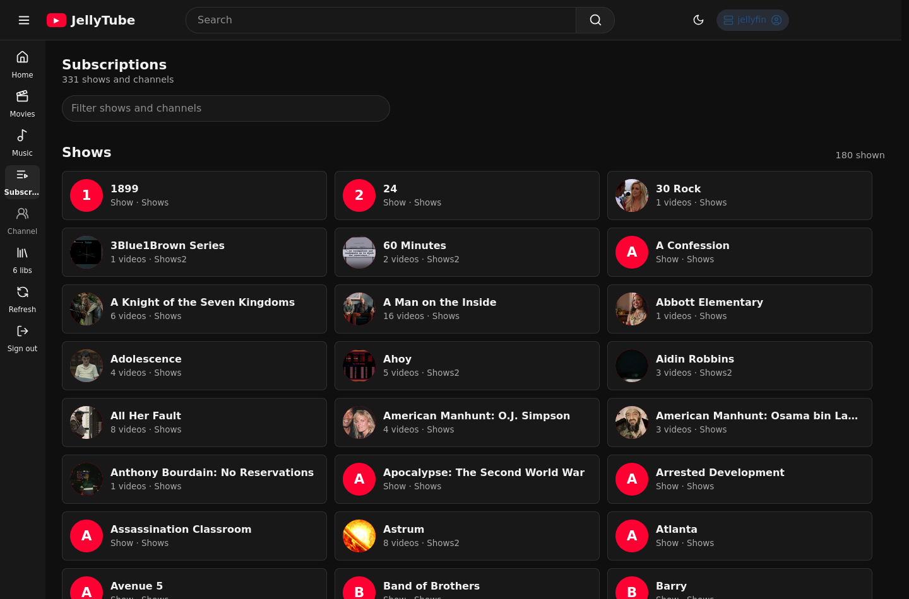
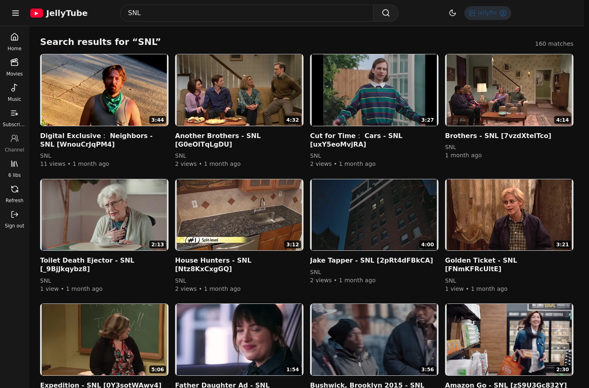
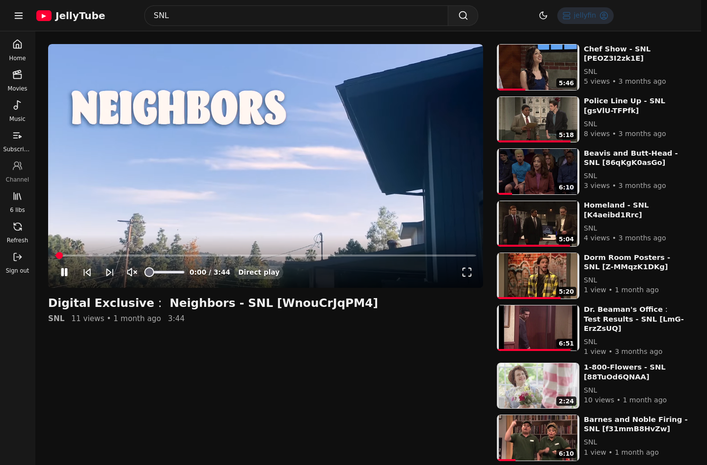
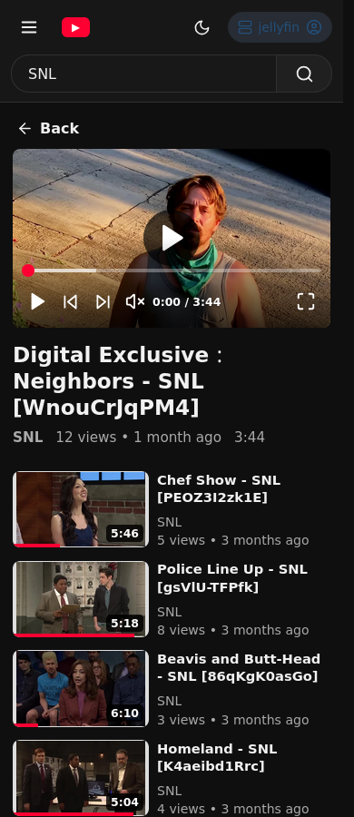

<p align="center">
  
</p>

<h1 align="center">JellyTube</h1>

JellyTube is a local, frontend-only Svelte application that turns selected Jellyfin libraries into a YouTube-style browsing and watching experience. It is designed for Jellyfin servers that already host downloaded YouTube archives, movies, episodic shows, and music videos.

## Preview

These screenshots live in `screenshots/` and are embedded here so users can preview JellyTube directly from the README.

<table>
  <tr>
    <td width="50%">
      
      <br>
      <strong>Home feed</strong>
    </td>
    <td width="50%">
      
      <br>
      <strong>Movies</strong>
    </td>
  </tr>
  <tr>
    <td width="50%">
      
      <br>
      <strong>Show guide</strong>
    </td>
    <td width="50%">
      
      <br>
      <strong>Music videos</strong>
    </td>
  </tr>
  <tr>
    <td width="50%">
      
      <br>
      <strong>Subscriptions</strong>
    </td>
    <td width="50%">
      
      <br>
      <strong>Search</strong>
    </td>
  </tr>
  <tr>
    <td width="50%">
      
      <br>
      <strong>Watch page</strong>
    </td>
    <td width="50%">
      
      <br>
      <strong>Mobile watch</strong>
    </td>
  </tr>
</table>

## What JellyTube Does

- **YouTube-like home feed** with Continue watching, Recommended, New videos, and Replay picks shelves.
- **Multiple Jellyfin library support** for Shows, Home Videos & Photos, Movies, and Music Videos libraries.
- **Dedicated Movies area** with poster-style cards, resume progress, featured/resume picks, and movie-only recommendations.
- **Music video mixes** that group videos by artist/channel and play as queue-backed playlists.
- **Subscriptions directory** that works as a searchable show/channel directory instead of a follow/unfollow system.
- **Season-aware show pages** for episodic libraries, including season selection, latest episode shortcuts, and lazy full-series loading.
- **Rich watch page** with direct play where possible, Jellyfin HLS fallback, persisted audio-language, caption, and aspect-ratio choices, resume position, queue/episode shelves, autoplay-next, volume persistence, 10-second seek controls, fullscreen, and responsive mobile layout.
- **Persistent mini-player** keeps the current video playing in the bottom-right corner while you browse; drag its top or left edges to resize it, and JellyTube remembers the preferred size.
- **Browser-native navigation** so search, channel, library, and watch routes survive refresh and work with back/forward buttons.
- **Light, dark, and system themes** saved in browser storage.

## Screenshot Tour

The README preview uses a curated screenshot set from the browser smoke workflow. The same workflow can generate additional route, history, autoplay, and failure-state screenshots locally.

To regenerate the screenshots, run the app and connect the smoke script to a Jellyfin test server:

```bash
npm run dev
BIDI_PORT=9226 \
JELLYTUBE_APP_URL=http://127.0.0.1:5173/ \
JELLYTUBE_SERVER_URL=http://your-jellyfin.example \
JELLYTUBE_USERNAME=your-jellyfin-user \
JELLYTUBE_PASSWORD=your-password \
SCREENSHOT_DIR=./screenshots \
node scripts/bidi-smoke.mjs
```

The smoke script requires a browser exposing a WebDriver BiDi endpoint on `BIDI_PORT` and writes PNG files to `SCREENSHOT_DIR`.

## Requirements

- Node.js 20+
- A Jellyfin server reachable from the browser running JellyTube
- A Jellyfin account with media playback access
- Jellyfin Playback Reporting plugin optional; JellyTube falls back to Jellyfin item resume/watched data without it
- At least one supported Jellyfin library:
  - **Shows** for episodic YouTube archives
  - **Home Videos & Photos** for general video archives
  - **Movies** for movie-style content
  - **Music Videos** for music-video collections

## Quick Setup On A Server

From the JellyTube directory on Linux, macOS, or WSL, run:

```bash
./scripts/quick-setup.sh
```

From the JellyTube directory on Windows, run:

```powershell
npm run setup:windows
```

The setup script installs dependencies, builds the production frontend, and starts JellyTube detached from the terminal.

Defaults:

- URL: `http://localhost:4173`
- Host binding: `0.0.0.0`
- Runtime files: `.jellytube/`
- PID file: `.jellytube/jellytube.pid`
- Log file: `.jellytube/jellytube.log`

Use a different port or host by setting environment variables:

```bash
JELLYTUBE_PORT=8088 JELLYTUBE_HOST=127.0.0.1 ./scripts/quick-setup.sh
```

On Windows:

```powershell
$env:JELLYTUBE_PORT = "8088"
$env:JELLYTUBE_HOST = "127.0.0.1"
npm run setup:windows
```

Stop the detached server with:

```bash
./scripts/stop.sh
```

On Windows:

```powershell
npm run stop:windows
```

## Production Commands

```bash
npm ci
npm run build
npm run serve
```

`npm run serve` serves the built `dist/` folder with SPA routing fallback and static asset caching. It does not run the Vite development server.

## Development

```bash
npm install
npm run dev
```

Open the local Vite URL, sign in with Jellyfin credentials, and select the Jellyfin libraries that should appear in JellyTube.

Useful development checks:

```bash
npm run check
npm run test:unit
npm test
```

## First-Run Flow

1. Enter the Jellyfin server URL, username, and password.
2. JellyTube validates that the account can play media and can access at least one supported library.
3. Select one or more supported Jellyfin libraries.
4. JellyTube saves the server URL, access token, user ID, selected libraries, and theme preference in browser local storage.
5. After onboarding, media and API requests are made directly from the browser to Jellyfin.

## Application Areas

### Home

The Home route is optimized for return visits. Continue watching appears first when Jellyfin has resume data, followed by latest additions, stable daily recommendations, new videos, and replay picks based on play count. Recommendations rank the complete selected video, movie, and music-video catalogs client-side, use per-user playback/favorite metadata and the optional Playback Reporting history, blend bounded results from Jellyfin's read-only Similar endpoint, diversify channels and series, and show a plain-language reason on each recommended card.

Ordered episodic series are represented once in both Home Recommended and the Watch page's Recommended rail as a show card rather than as an arbitrary episode. The card uses complete series progress to offer the correct `Start`, `Next`, `Resume`, or `Replay` episode and opens playback with the ordered episode queue. Sequence classification accepts canonical Jellyfin TV identities (`Tvdb`, `Tmdb`, or `Imdb`) as well as explicit leading episode-code conventions, while retaining catalog-completeness, index-coverage, identity-consistency, and duplicate-slot guards. Jellyfin series that behave like unordered YouTube or clip archives remain individual video cards; ambiguous metadata always falls back to item-level recommendations.

### Movies

Movies are intentionally separated from normal channel uploads. Movie cards use poster-style presentation, movie metadata points back to the Movies route, and watch-page recommendations stay movie-only.

### Music Videos

Music Videos groups compatible items into artist/channel mixes. Opening a mix starts a queue-backed watch flow with autoplay-next behavior and the queue panel visible beside the player.

### Subscriptions

Subscriptions is a directory, not a subscription-management feature. It derives shows and channels from already-loaded Jellyfin items, supports filtering, and avoids eager full-series API expansion until a channel/show is opened.

### Channels And Shows

Non-episodic channels show a latest-by-release-date grid plus replay picks. Episodic shows use season-aware guides with episode ordering and actions to play the latest episode or the selected season.

### Search

Search works across selected libraries and ranks likely show/episode matches above unrelated title matches. Results preserve visual identity, so movies, episodes, music videos, and standard videos remain distinguishable.

### Watch

The Watch page prepares a direct stream when the browser can play it and falls back to Jellyfin HLS when needed. Videos with multiple audio streams expose an audio-track menu beside captions; the semantic language/title choice is saved per Jellyfin server and user, carried into Jellyfin playback negotiation/reporting, and resolved safely when later videos have different stream indexes or available tracks. Alternate embedded tracks use HLS because a static direct-play URL cannot select a non-container-default track. The aspect-ratio menu preserves the source by default, can stretch incorrectly formatted media to 4:3, 16:9, or 21:9 without cropping, and retains the existing 21:9 crop mode. The player reports progress to Jellyfin, resumes from saved playback position, persists volume/mute state, supports seeking and fullscreen, and can continue through episode shelves or mix queues. Its recommendation rail projects ranked items only after excluding the current series, so an ordered show appears once with the user's progress action and cannot reappear beside one of its own episodes.

### Recommendation Quality Diagnostics

Recommendation diagnostics are opt-in and run entirely in the browser against the signed-in user's selected Jellyfin libraries. They report aggregate catalog coverage, metadata/history coverage, duplicate and eligibility violations, channel/series concentration, explanation coverage, Similar-signal coverage, and a deterministic latest-play proxy backtest at ranks 12 and 28. The proxy compares the complete catalog with the former bounded recent-item pool and reports results per content kind; it is not a click-through-rate or satisfaction measurement because Jellyfin exposes aggregate/latest play state rather than recommendation impressions.

Top-12 and top-28 list metrics are calculated after the same ordered-show projection used by the rendered Home shelf. Each report includes `itemCards` and `showCards`, so collapsing several ranked episodes into one show card cannot make diagnostic concentration, duplication, or list-size measurements describe a different list than the user sees.

Enable diagnostics in the browser console, then reload:

```js
localStorage.setItem('jellytube.recommendationDiagnostics.v1', 'true');
location.reload();
```

The aggregate report is printed to the console and stored for the current tab at `jellytube.recommendationDiagnostics.latest` in session storage. It contains no item IDs, titles, user identifiers, library names, tokens, server URLs, or raw dates:

```js
JSON.parse(sessionStorage.getItem('jellytube.recommendationDiagnostics.latest'));
```

Disable and clear the report with:

```js
localStorage.removeItem('jellytube.recommendationDiagnostics.v1');
sessionStorage.removeItem('jellytube.recommendationDiagnostics.latest');
```

Diagnostics perform the same complete metadata paging as normal recommendation loading and up to 60 local backtest events. Jellyfin is only read; playback state, server configuration, and media are not modified or downloaded by the evaluator.

### Library Settings

The Libraries route lets server owners add or remove supported Jellyfin libraries after onboarding without signing out.

## Configuration

The production server reads these optional environment variables:

| Variable | Default | Description |
| --- | --- | --- |
| `JELLYTUBE_HOST` | `0.0.0.0` | Host/IP address for the production server to bind. |
| `JELLYTUBE_PORT` | `4173` | Port for the production server. |
| `JELLYTUBE_DIST` | `dist` | Directory containing the built frontend. |
| `JELLYTUBE_RUNTIME_DIR` | `.jellytube` | Runtime directory used by quick setup. |
| `JELLYTUBE_PID_FILE` | `.jellytube/jellytube.pid` | PID file for the detached server. |
| `JELLYTUBE_LOG_FILE` | `.jellytube/jellytube.log` | Log file for the detached server. |

## Data And Security Notes

JellyTube is a frontend-only app. It does not proxy Jellyfin credentials or media through a backend service. Credentials and session data are stored in the user's browser local storage, and media/API calls go directly from the browser to the configured Jellyfin server.

Because JellyTube runs in the browser, the Jellyfin server must be reachable from that browser and configured to allow the browser requests needed by your deployment.
